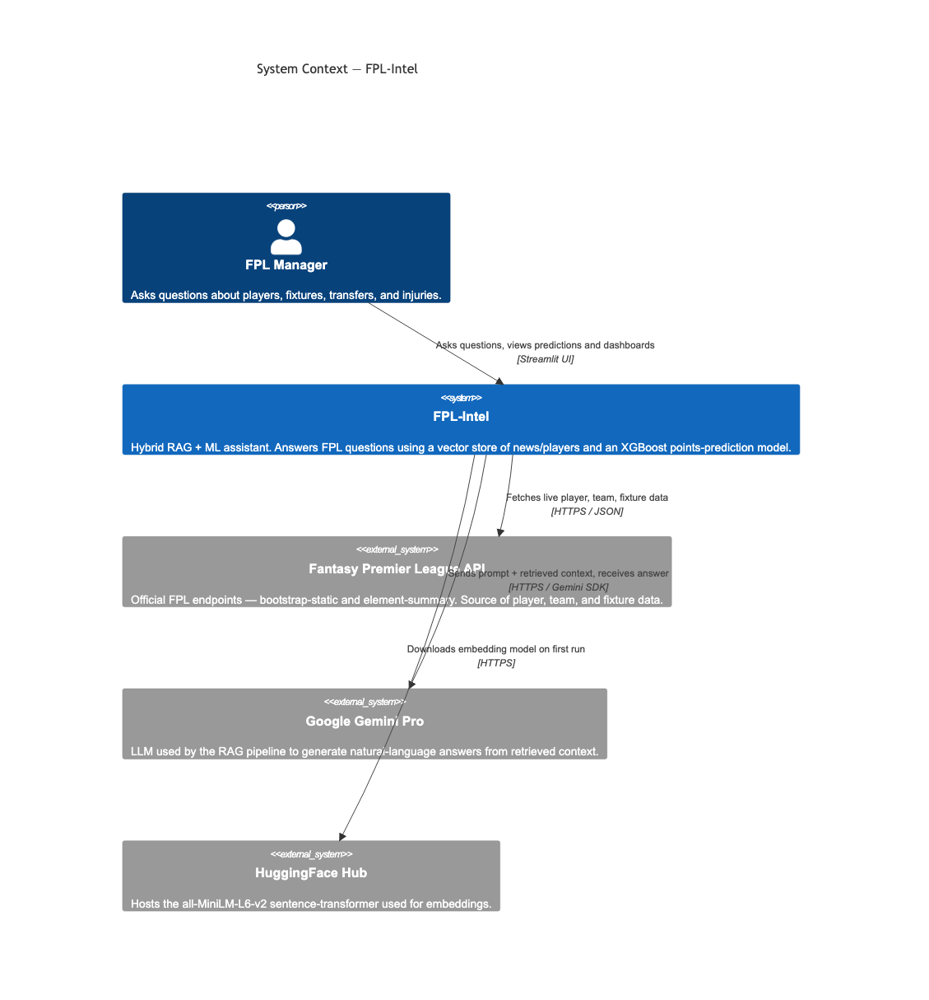
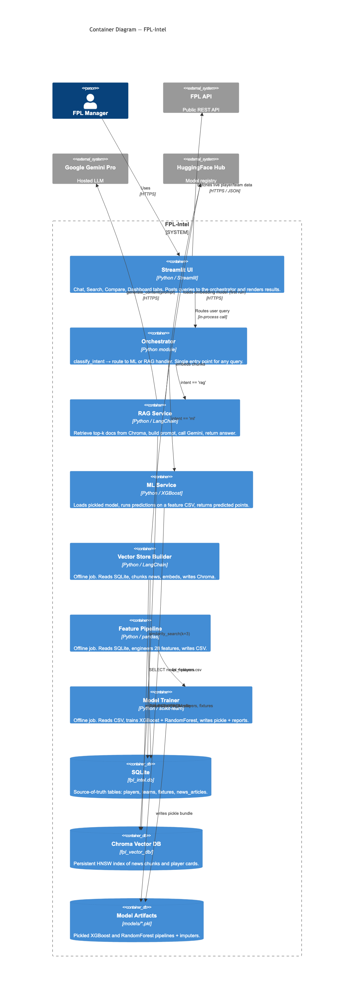
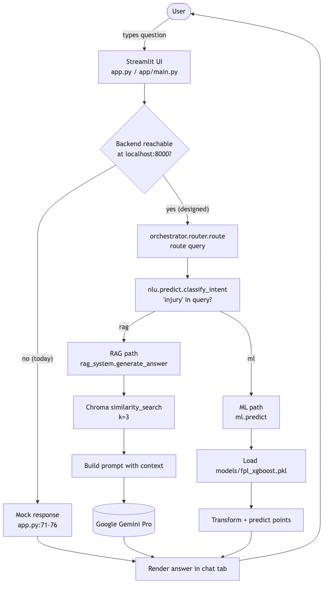
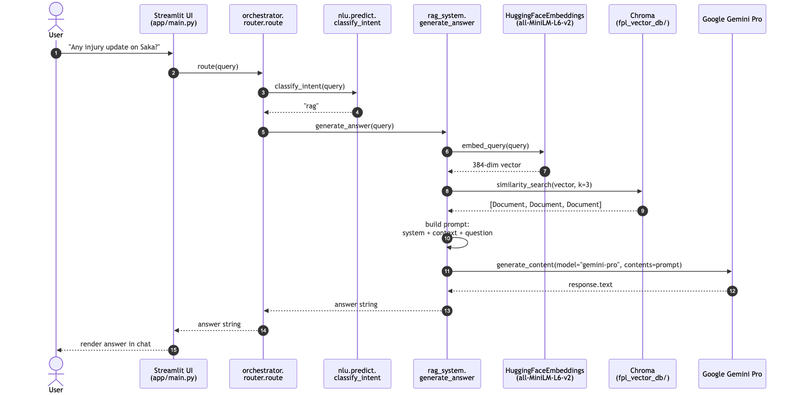

# FPL-Intel

## Project Overview

FPL-Intel is a Retrieval-Augmented Generation (RAG) system built around a structured vector store and an orchestration layer for document retrieval, natural language understanding, and response generation.

The repository includes tools for building a vector store from source data, retrieving relevant passages, evaluating model responses, and running a RAG pipeline for question answering.

## Key Components

- `build_vector_store.py`: Builds the vector index and persistence layer for embeddings.
- `retriever.py`: Retrieves relevant documents from the vector store.
- `rag_system.py`: Main RAG orchestration logic and integration point.
- `orchestrator/`: Contains orchestration and pipeline components for coordinating retrieval and generation.
- `nlu/`: Natural language understanding utilities.
- `evaluation/`: Scripts and utilities for scoring model outputs and validating retrieval quality.
- `ml/`: Machine learning utilities used for embeddings, model inference, and evaluation.
- `pipeline/`: Execution pipeline definitions and workflow integration.
- `fpl_vector_db/`: Vector database storage files and supporting logic.
- `app/`: Application-level entry points and wrappers.

## Documented Changes

The project history currently includes the following development milestones:

1. **Initial upload of RAG s7s project**
   - Created the base repository structure.
   - Added the core project files and initial packages.
   - Established the foundation for vector-based retrieval and RAG orchestration.

2. **Project structure setup**
   - Added modular folders for `app`, `evaluation`, `ml`, `nlu`, `orchestrator`, `pipeline`, and `rag`.
   - Included the vector database layer under `fpl_vector_db`.
   - Prepared `requirements.txt` and initial support files for future development.

3. **Feature branch merge: `feature/rag`**
   - Integrated RAG-specific functionality into the main branch.
   - Added or updated `rag_system.py` to centralize retrieval and generation flows.
   - Extended vector store building and retrieval code to support production-like workflows.

## Current Status

- The repository is clean with no uncommitted changes detected in the current working directory.
- The main development focus is on improving the vector store build process, retrieval logic, and RAG orchestration layer.

## Architecture

FPL-Intel is a hybrid RAG + ML assistant. A user query enters through the Streamlit UI, gets routed by an intent classifier, and is answered by either the **RAG pipeline** (Chroma + Google Gemini) for news/Q&A or the **ML pipeline** (XGBoost) for points prediction. SQLite is the source of truth; Chroma and the pickle bundles are derived stores rebuilt by offline scripts.

The four diagrams below are the at-a-glance story. Full documentation — three C4 levels, two data-flow diagrams, and detailed sequence diagrams — lives in [`docs/`](docs/README.md).

### System context (C4 — Level 1)

<p align="center"></p>

> Source: [`docs/architecture/c4-context.md`](docs/architecture/c4-context.md)

### Containers (C4 — Level 2)

<p align="center"></p>

> Source: [`docs/architecture/c4-container.md`](docs/architecture/c4-container.md)

### Request lifecycle

<p align="center"></p>

> Source: [`docs/sequence/request-lifecycle.md`](docs/sequence/request-lifecycle.md)

### Sequence — RAG chat query

<p align="center"></p>

> Source: [`docs/sequence/chat-rag-sequence.md`](docs/sequence/chat-rag-sequence.md)

### Documentation map

The full set of diagrams lives under [`docs/`](docs/README.md):

| Layer | File | What you learn |
|-------|------|----------------|
| C4 — Context | [`docs/architecture/c4-context.md`](docs/architecture/c4-context.md) | Users and external services |
| C4 — Containers | [`docs/architecture/c4-container.md`](docs/architecture/c4-container.md) | Runnable parts and stores |
| C4 — Components | [`docs/architecture/c4-component.md`](docs/architecture/c4-component.md) | Inside the orchestrator + RAG service |
| Data flow — Ingestion / ML | [`docs/dataflow/ingestion-pipeline.md`](docs/dataflow/ingestion-pipeline.md) | FPL data → trained models |
| Data flow — RAG indexing | [`docs/dataflow/rag-indexing-pipeline.md`](docs/dataflow/rag-indexing-pipeline.md) | SQLite → Chroma vector store |
| Sequence — Request lifecycle | [`docs/sequence/request-lifecycle.md`](docs/sequence/request-lifecycle.md) | End-to-end query flow |
| Sequence — RAG chat | [`docs/sequence/chat-rag-sequence.md`](docs/sequence/chat-rag-sequence.md) | Detailed RAG branch |
| Sequence — ML prediction | [`docs/sequence/ml-prediction-sequence.md`](docs/sequence/ml-prediction-sequence.md) | Detailed ML branch |
| Sequence — Offline training | [`docs/sequence/offline-training-sequence.md`](docs/sequence/offline-training-sequence.md) | Maintainer workflow for retraining + reindexing |

## Notes on Recent Work

- `build_vector_store.py` is responsible for constructing the vector store used by the retriever.
- The overall system is designed to support evaluation, model orchestration, and retrieval from a structured vector database.

## Next Steps

- Add usage examples and command-line instructions.
- Document configuration and dependency setup in `requirements.txt`.
- Expand the evaluation and NLU modules with more tests and validation scenarios.

---

## Data Pipeline Contribution

## Andrew George

My contribution to this project is the **data pipeline** that feeds the RAG recommendation system with structured, model-ready player data.

| File | Role |
|---|---|
| `features.py` | Loads the FPL database, engineers features, exports `fpl_features.csv` |
| `train.py` | Reads the CSV, trains ML models, exports `.pkl` files to `models/` |
| `predict.py` | Loads a model and a CSV, runs predictions, prints results |

## How to Run

**Step 1 — Extract features from the database:**

```bash
python features.py
```

Outputs: `data/fpl_features.csv` must be `data/fpl_intel.dp` in the same directory otherwise specify the path after file_name.

**Step 2 — Train the models:**

```bash
python train.py
```

Outputs: `models/fpl_xgboost.pkl`, `models/fpl_randomforest.pkl`, etc.

**Step 3 — Run predictions:**

```bash
python predict.py "data/test_group.csv"
```

## Features Engineered (28 total)

From raw FPL stats, the pipeline computes:

- **Per-90 rates** — goals, assists, clean sheets, bonus, ICT per 90 mins
- **Consistency metrics** — appearance rate, average minutes per gameweek
- **Fixture difficulty** — upcoming opponent strength, fixture ease score
- **Team context** — team average goals scored/conceded
- **Flags** — injury news detected from player news text, availability

## Models & Results

Three models are trained and compared. Best performer:

| Model | MAE | RMSE | R² |
| --- | --- | --- | --- |
| XGBoost ⭐ | ~4.9 pts | ~7.1 pts | 0.974 |
| Random Forest | 6.10 pts | 8.95 pts | 0.959 |

## Output for the RAG System

`fpl_features.csv` — one row per active player, containing all 28 engineered features plus identity columns (`web_name`, `position_name`, `price`, `total_points`). This is the file the RAG retriever indexes to answer questions like _"who is the best value defender with easy fixtures?"_.

