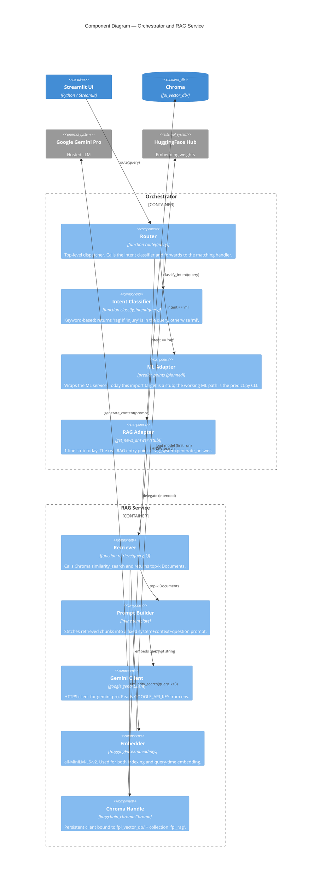

# C4 — Level 3: Components

This level zooms inside the two most interesting containers — **Orchestrator** and **RAG Service** — and names the components that do the work. The ML, indexing, and training containers are intentionally not expanded here: each is a single short script and the data-flow diagrams already show their internals.

## Components inside Orchestrator + RAG

## Component-by-component

### Orchestrator

- **Router** — `orchestrator/router.py:5`. Single function `route(query)`. Returns either an ML payload, a RAG string, or both (when intent is "unknown").
- **Intent Classifier** — `nlu/predict.py:1`. Today a 4-line keyword check (`if "injury" in query: return "rag"`). Future work: replace with a real classifier; the contract is just `query -> {"ml", "rag"}`.
- **ML Adapter** — imported as `from ml.predict import predict_points`. The current `ml/predict.py` is a CLI script with no `predict_points` function exported, so this import path is a known wiring gap. The ML pipeline itself works fine when invoked as a script.
- **RAG Adapter** — `rag/generate.py:1`. Returns the literal string `"Sample news response"`. The real RAG entry point is `rag_system.generate_answer` and should be wired here.

### RAG Service

- **Retriever** — `rag_system.py:23` (and an identical standalone copy at `retriever.py:18`). Thin wrapper around `vector_db.similarity_search(query, k=3)`.
- **Prompt Builder** — inline template at `rag_system.py:32-43`. Hard-codes the system instruction "You are a Fantasy Premier League assistant" and a "Use ONLY the context below" guardrail.
- **Gemini Client** — `rag_system.py:8`. Constructed once at import time using `GOOGLE_API_KEY`. Calls `client.models.generate_content(model="gemini-pro", contents=prompt)` per request.
- **Embedder** — `rag_system.py:11`, `build_vector_store.py:69`. The same `all-MiniLM-L6-v2` model is used for both indexing and query-time embeddings (this is critical — different models would produce incompatible vector spaces).
- **Chroma Handle** — `rag_system.py:16-20`. Persistent client bound to `./fpl_vector_db` and collection `fpl_rag`. Uses HNSW under the hood.

## What's deliberately not modelled here

- The **Streamlit tabs** (Search, Compare, Dashboard) are mostly self-contained UI logic that calls the FPL API directly — they're shown as part of the UI container at L2 and don't need a component diagram of their own.
- The **ML training internals** (StandardScaler, SimpleImputer, XGBRegressor, RandomForestRegressor, train/test split) are documented in `dataflow/ingestion-pipeline.md` and `sequence/offline-training-sequence.md` instead — those views answer "what happens during training" better than a static component diagram would.
