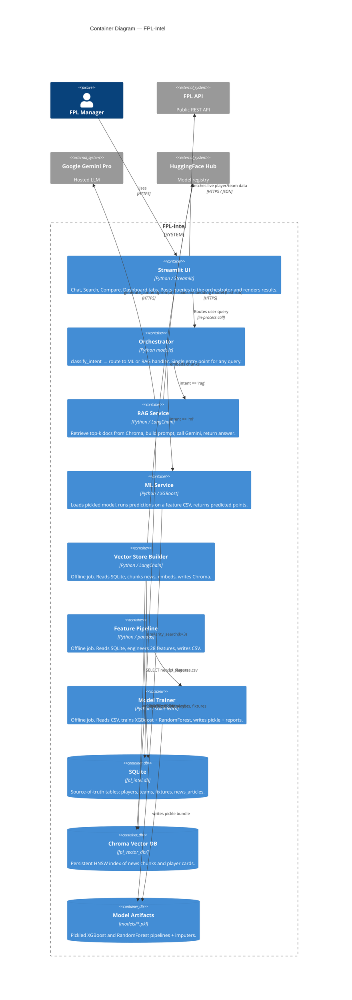

# C4 — Level 2: Containers

Inside the FPL-Intel system there are two long-running processes (the Streamlit UI and the planned chat backend), four logical services that run as Python modules (Orchestrator, RAG, ML, NLU), and three persistent stores. The diagram below shows them and the calls between them.

## Containers, in plain English

| Container | What it is | When it runs |
|-----------|-----------|--------------|
| **Streamlit UI** | Single-process Streamlit app; renders four tabs and holds chat session state. | Long-running while a user is browsing. |
| **Orchestrator** | A small `route(query)` function. Calls the NLU intent classifier, then dispatches. | Per request. |
| **RAG Service** | The retrieve-then-generate pipeline. Owns the Chroma handle, embeddings, and Gemini client. | Per RAG request. |
| **ML Service** | The points-prediction inference path. Loads the pickled bundle and runs `predict`. | Per ML request. |
| **Vector Store Builder** | One-shot script that builds `fpl_vector_db/` from SQLite. | Manually, when news/players change. |
| **Feature Pipeline** | One-shot script that builds `data/fpl_features.csv` from SQLite. | Manually, before retraining. |
| **Model Trainer** | One-shot script that consumes the CSV and produces `.pkl` files. | Manually, when the feature set changes. |
| **SQLite** | The single source of truth. All other stores derive from it. | Always present on disk. |
| **Chroma** | Vector store consulted during RAG. | Always present on disk. |
| **Model Artifacts** | Pickled scikit-learn + XGBoost pipeline. | Always present on disk after first training. |

## Wiring gaps (designed vs. implemented)

Two dotted lines in the diagram are aspirational rather than wired up:

- `app.py:9` defines `BACKEND_URL = "http://localhost:8000/chat"` and `app.py:68` POSTs to it, but **no HTTP server is started** by the project today. When the call fails, the chat tab falls back to a hardcoded mock response (`app.py:71-76`). The smaller `app/main.py` *does* call `orchestrator.router.route` directly in-process — that is the path that currently works end-to-end.
- `rag/generate.py:1` is a 1-line stub returning `"Sample news response"`. The real RAG implementation lives at module-level in `rag_system.py`. The orchestrator imports the stub via `from rag.generate import get_news_answer`, so RAG answers from the orchestrator path are currently placeholders.

Both are reflected in the per-sequence diagrams as well.

## Source pointers

| Container | Code |
|-----------|------|
| Streamlit UI | `app.py`, `app/main.py` |
| Orchestrator | `orchestrator/router.py:5` |
| NLU (used by orchestrator) | `nlu/predict.py:1` |
| RAG Service | `rag_system.py:23` (`retrieve`), `rag_system.py:27` (`generate_answer`) |
| ML Service | `ml/predict.py` |
| Vector Store Builder | `build_vector_store.py` |
| Feature Pipeline | `ml/features.py` |
| Model Trainer | `ml/train.py` |
| SQLite | `fpl_intel.db` |
| Chroma | `fpl_vector_db/` |
| Model Artifacts | `models/fpl_xgboost.pkl`, `models/fpl_randomforest.pkl` |
