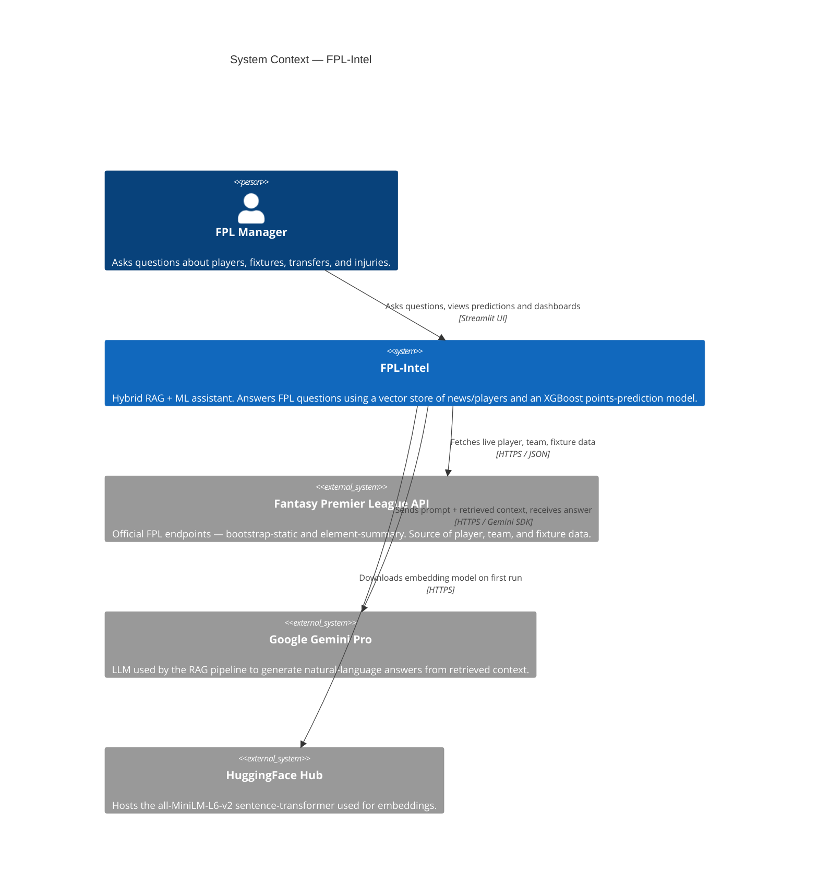

# C4 — Level 1: System Context

**FPL-Intel** sits between a single human user (an FPL manager) and three external services. The user asks football questions in natural language; the system answers with player predictions, news summaries, and recommendations by combining its own data with calls to the upstream services below.

## Notes

- The user only ever interacts with FPL-Intel through the Streamlit UI — the external services are never called directly from the browser.
- The FPL API is **read-only** (no auth, no writes). The system caches its responses with `@st.cache_data` (see `app.py:17`).
- Google Gemini is only contacted on the RAG path; the ML path is fully local once models are trained.
- HuggingFace Hub is contacted once per environment to download the embedding weights — afterwards the model lives in the local HuggingFace cache.

## Source pointers

| Boundary | Code |
|----------|------|
| Streamlit UI entry | `app.py`, `app/main.py` |
| FPL API client | `app.py:17-26` (`load_data`, `get_player_history`) |
| Gemini client | `rag_system.py:8` |
| HuggingFace embeddings | `rag_system.py:11`, `build_vector_store.py:69` |
