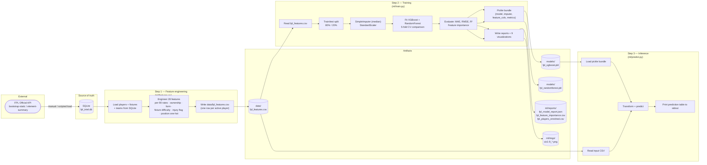

# Data Flow — Ingestion & ML Pipeline

This is the offline path that turns raw FPL data into a deployable XGBoost model. It runs as three manual steps today (no scheduler is wired up yet); the diagram shows the full chain so you can see how each artifact feeds the next.



## What each step produces

| Step | Script | Reads | Writes |
|------|--------|-------|--------|
| 1. Features | `ml/features.py` | `fpl_intel.db` | `data/fpl_features.csv` |
| 2. Training | `ml/train.py` | `data/fpl_features.csv` | `models/*.pkl`, `ml/reports/*`, `ml/imgs/*` |
| 3. Inference | `ml/predict.py <csv>` | `models/fpl_xgboost.pkl` + input CSV | stdout table |

## The pickle bundle format

`predict.py` expects every `models/*.pkl` to be a **dict bundle**, not a bare estimator:

```python
{
    "model":        XGBRegressor(...),
    "imputer":      SimpleImputer(strategy="median"),
    "feature_cols": [...],          # 28 column names, exact order
    "model_name":   "XGBoost",
    "metrics":      {"MAE": 4.89, "RMSE": 7.11, "R2": 0.974}
}
```

This bundle pattern is what makes inference re-runnable from any CSV that was generated by the same `features.py` — the column order and imputer strategy travel with the model.

## Current results (XGBoost, best model)

| Metric | Value |
|--------|-------|
| MAE | ~4.9 pts |
| RMSE | ~7.1 pts |
| R² | 0.974 |

Top feature importances: `appearance_rate`, `avg_minutes_per_gw`, `ict_index`, `minutes`, `bonus`.

## Notes & gaps

- The arrow from FPL API → SQLite is **manual today**. The empty file `pipeline/fpl_api.py` is the placeholder for an automated loader.
- `pipeline/scheduler.py` is also empty — there is no cron/Airflow wiring. Re-training happens when a maintainer runs the three commands.
- `ml/reports/fpl_players_enriched.csv` is also fed into the RAG indexing pipeline (see `rag-indexing-pipeline.md`) so the vector store reflects the latest model predictions.
