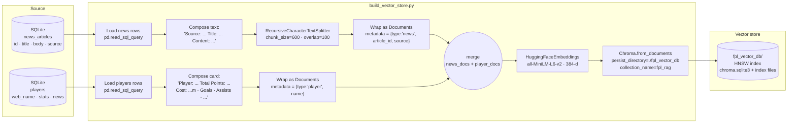

# Data Flow — RAG Indexing Pipeline

This is the offline path that turns SQLite rows into a Chroma vector store. It runs once with `python build_vector_store.py` and produces the `fpl_vector_db/` directory the RAG service queries at runtime.

## Two document types in one collection

| Type | Source row | One row → ? docs | Metadata |
|------|------------|------------------|----------|
| `news` | one row in `news_articles` | 1+ chunks (600 chars, 100 overlap) | `{type, article_id, source}` |
| `player` | one row in `players` | exactly 1 doc | `{type, name}` |

Both types live in the same Chroma collection (`fpl_rag`) so a single `similarity_search` can mix news context with player-card context. At query time the retriever doesn't filter on `type` — it just picks the top-k most similar documents regardless of source.

## Why the same embedding model on both sides

The retriever in `rag_system.py:11` instantiates `HuggingFaceEmbeddings(model_name="all-MiniLM-L6-v2")` and the indexer in `build_vector_store.py:69` does the same. **They must match.** A different embedding model would project queries into a different vector space than the documents, and similarity search would return garbage even though no error is raised.

## When to rebuild the index

Run `python build_vector_store.py` whenever:

- New rows are added to `news_articles` (a news scraper run).
- The `players` table is refreshed from the FPL API.
- You change the `composePlayer` / `composeNews` text formatting.
- You change `chunk_size` or `chunk_overlap`.

The build is idempotent at the **collection** level — `Chroma.from_documents` will append to an existing collection if you don't clear `fpl_vector_db/` first. For a clean rebuild, delete the directory before running.

## Notes & gaps

- The `pipeline/news_scraper.py` file is empty. News articles get into SQLite by hand today; automating that scraper is the natural next step.
- There is no incremental indexing — every run reprocesses every row.
