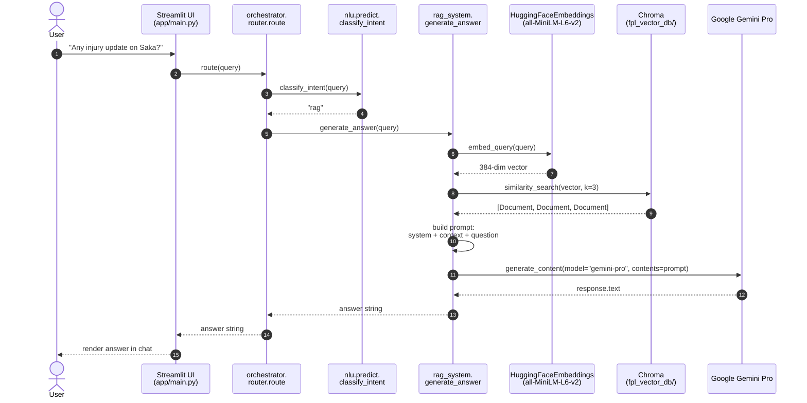

# Sequence — RAG Chat Query

What happens, step by step, when a user asks a question that the intent classifier routes to the RAG path (currently any query containing "injury"). This is the most network-heavy lifecycle in the system: it touches Chroma locally and Google Gemini over HTTPS.



## Step-by-step

| # | What happens | Code |
|---|--------------|------|
| 1 | User types into `st.chat_input` | `app.py:59` (or `app/main.py:12`) |
| 2 | UI hands query to the router | `app/main.py:15` |
| 3 | Router asks NLU for intent | `orchestrator/router.py:6` |
| 4 | Keyword classifier returns "rag" | `nlu/predict.py:3` |
| 5 | Router invokes the RAG entry point | `orchestrator/router.py:11` (currently calls a stub — the real entry is `rag_system.generate_answer`) |
| 6 | Query is embedded with MiniLM | implicit inside `vector_db.similarity_search` via the embedding function bound to the Chroma handle (`rag_system.py:18`) |
| 7 | Chroma returns top-3 documents | `rag_system.py:24` |
| 8 | Prompt is composed inline | `rag_system.py:32-43` |
| 9 | Gemini call | `rag_system.py:45-48` |
| 10 | Response text is returned up the stack | `rag_system.py:50` |
| 11 | UI renders the answer | `app/main.py:16` |

## What's in the prompt

The prompt template hard-codes a single guardrail: **answer only from the retrieved context**. From `rag_system.py:32-43`:

```
You are a Fantasy Premier League assistant.

Use ONLY the context below to answer the question.
If the answer is not in the context, say you don't know.

Context:
{joined top-3 doc page_content}

Question:
{user query}
```

There is no chat history, no few-shot examples, and no retrieved-doc citations. The retrieval result is the entire grounding signal.

## Failure modes worth knowing

- **`GOOGLE_API_KEY` missing** — the Gemini client construction at `rag_system.py:8` succeeds with an empty key, but `generate_content` returns an auth error at request time. Symptom: the chat tab shows an exception instead of an answer.
- **Chroma collection empty** — if `build_vector_store.py` has never been run, `similarity_search` returns `[]` and the prompt context is empty. Gemini will then say "I don't know" because the guardrail forbids hallucinating.
- **Embedding model first-run download** — the very first call to `HuggingFaceEmbeddings(...)` on a fresh machine downloads ~80MB from HuggingFace Hub. Slow networks make the first query feel hung. Subsequent runs use the local cache.
