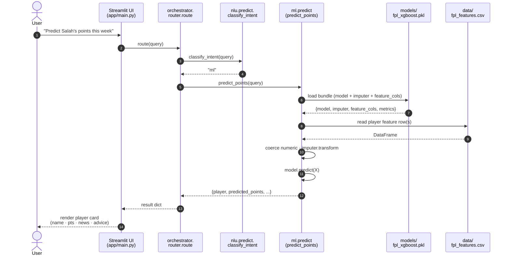

# Sequence — ML Prediction Query

What happens when the intent classifier routes a query to the ML path. This path is fully local — once the pickle bundle is loaded it makes no network calls — so it's both faster and cheaper than the RAG path.



## Step-by-step

| # | What happens | Code |
|---|--------------|------|
| 1 | User types a non-injury question | `app.py:59` / `app/main.py:12` |
| 2 | UI dispatches to router | `app/main.py:15` |
| 3 | NLU classifies intent as "ml" | `nlu/predict.py:4` |
| 4 | Router calls ML adapter | `orchestrator/router.py:9` |
| 5 | Pickle bundle loaded once | `ml/predict.py:33-39` |
| 6 | Feature CSV read | `ml/predict.py:56` |
| 7 | Numeric coercion + median imputation | `ml/predict.py:75-79` |
| 8 | XGBoost prediction | `ml/predict.py:81` |
| 9 | Result formatted for the UI | (script today prints to stdout — needs an adapter to return a dict for the orchestrator path) |
| 10 | UI shows player + predicted points + advice | `app.py:79-82` |

## Pickle bundle contract

The ML path depends on **exact feature alignment** between training and inference. The pickle bundle enforces this by carrying the column list with the model:

```python
{
    "model":        XGBRegressor(...),       # trained estimator
    "imputer":      SimpleImputer(...),      # fitted on training data
    "feature_cols": [...],                    # 28 names, exact order
    "model_name":   "XGBoost",
    "metrics":      {"MAE": 4.89, ...}
}
```

`ml/predict.py:60-65` validates that every name in `feature_cols` appears as a column in the input CSV and aborts with a clear error otherwise. This is the contract between `features.py` and `predict.py` — change the feature list in one place and you must retrain.

## Why this path needs no LLM

The model returns a numeric score (predicted points). The chat UI presents it as a "card" with predicted points and a short text rationale, but the rationale is a fixed string today — there is no LLM call on this path. If you want a natural-language explanation of the prediction, that's a future feature: feed the prediction + top features into Gemini as part of the response.

## Wiring gap to be aware of

The orchestrator imports `from ml.predict import predict_points`, but `ml/predict.py` exposes no such function — it's a CLI script that runs at import time and exits if no CSV path is given. As of today, calling `route(query)` on an "ml" intent will error during import. The fix is to factor the load-and-predict body of `predict.py` into a `predict_points(query)` function and have the existing CLI block call it.
