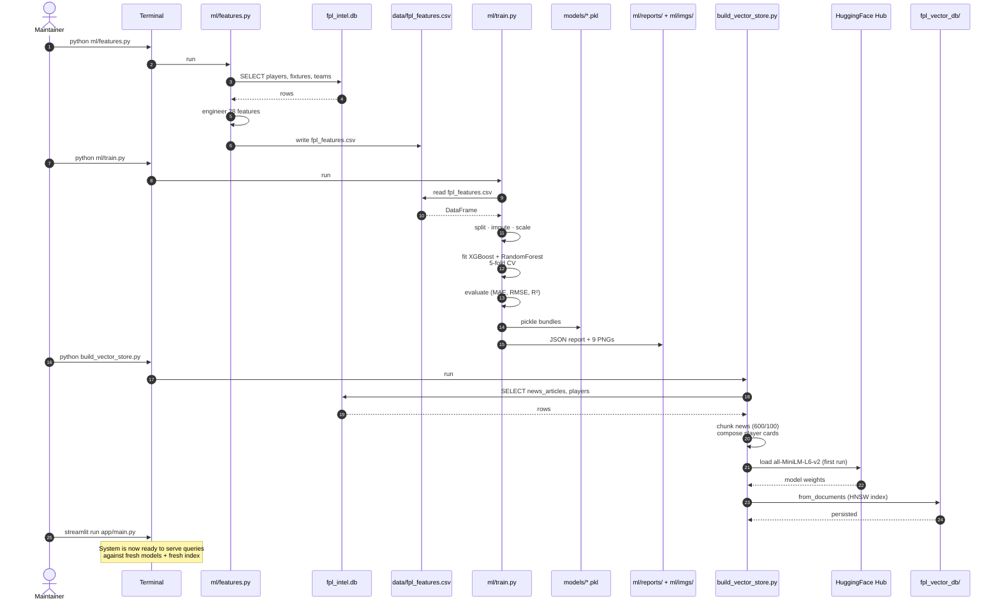

# Sequence — Offline Training & Indexing

What a maintainer does when they want to refresh the model and the vector store. This is not a request lifecycle — it's a workflow run from the command line in a specific order. The sequence diagram makes the order explicit so contributors don't accidentally run training without features, or query the system against a stale index.



## The three commands

```bash
python ml/features.py        # Step 1 — features
python ml/train.py           # Step 2 — train
python build_vector_store.py # Step 3 — index
```

Run them in order. Each step depends on the artifact written by the previous one (or by the upstream SQLite database).

## When you need to re-run each step

| Step | Re-run when |
|------|-------------|
| `features.py` | The SQLite tables changed (new gameweek, new players, new fixtures, refreshed news), or you added/removed a feature. |
| `train.py` | `data/fpl_features.csv` changed, or you tweaked hyperparameters / model choices. |
| `build_vector_store.py` | `news_articles` or `players` changed, or you changed chunk size / overlap / document templates. |

You don't always need all three. A pure news refresh only needs step 3. A pure model retune (no new features) only needs step 2.

## Outputs at a glance

After all three runs, the working tree contains:

```
data/fpl_features.csv           ← one row per active player, 28 features + identity
models/fpl_xgboost.pkl          ← best model bundle (MAE ~4.9 pts)
models/fpl_randomforest.pkl     ← second model bundle
ml/reports/fpl_model_report.json
ml/reports/fpl_feature_importance.csv
ml/reports/fpl_players_enriched.csv
ml/imgs/viz1-9_*.png            ← 9 evaluation plots
fpl_vector_db/                  ← Chroma persistent store
```

## Notes & gaps

- **No scheduler.** `pipeline/scheduler.py` is an empty stub. There is no cron, no Airflow, no Prefect — refreshes are entirely manual.
- **No data loader for SQLite.** `pipeline/fpl_api.py` and `pipeline/news_scraper.py` are also empty stubs. The SQLite database is populated externally today.
- **First-run download.** The first `build_vector_store.py` run on a clean machine downloads ~80MB of embedding weights from HuggingFace Hub. Subsequent runs use the local cache.
