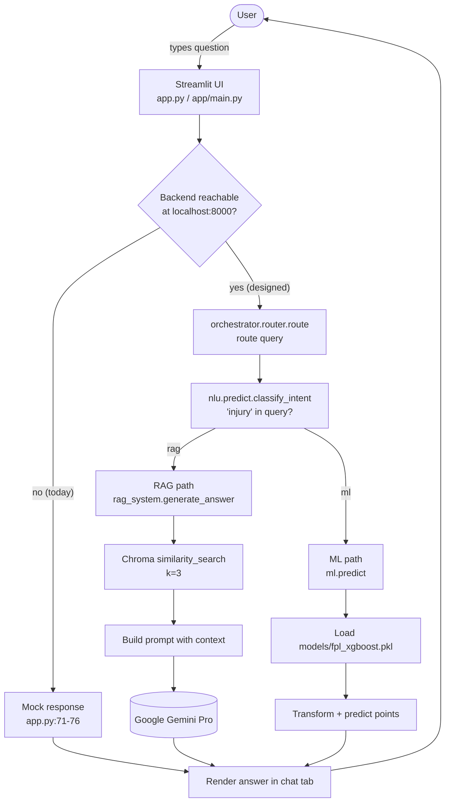

# Request Lifecycle (Overview)

Every user query — from any tab — follows the same lifecycle. This flowchart is the "you are here" map for the two detailed sequence diagrams that follow it (chat-rag-sequence.md and ml-prediction-sequence.md).



## The five phases

1. **UI capture** — The user types into the chat input on `tab1` of `app.py` (or the simpler input in `app/main.py`).
2. **Transport** — `app.py` POSTs to `http://localhost:8000/chat`; `app/main.py` calls the router in-process. Today only the in-process path works end-to-end; the HTTP backend is a planned container.
3. **Routing** — `orchestrator.router.route(query)` calls `classify_intent` and forwards to either the ML or RAG handler.
4. **Handler work** — RAG retrieves context from Chroma and asks Gemini; ML loads the pickle bundle and runs prediction.
5. **Render** — Streamlit displays the structured response (player name + predicted points + news + advice for ML; free-text answer for RAG).

## Decision boundary: ML vs RAG

The current intent classifier is a single keyword check (`nlu/predict.py`):

```python
def classify_intent(query):
    if "injury" in query:
        return "rag"
    return "ml"
```

So today the lifecycle splits roughly like this:
- *"Will Salah play this gameweek?"* → no "injury" keyword → **ML path** (predicted points).
- *"What's the latest injury news for Saka?"* → contains "injury" → **RAG path** (news answer).

This is intentionally simple and is the obvious place to swap in a real classifier later — the rest of the lifecycle doesn't have to change.

## See also

- [`chat-rag-sequence.md`](chat-rag-sequence.md) — what the RAG branch actually does.
- [`ml-prediction-sequence.md`](ml-prediction-sequence.md) — what the ML branch actually does.
